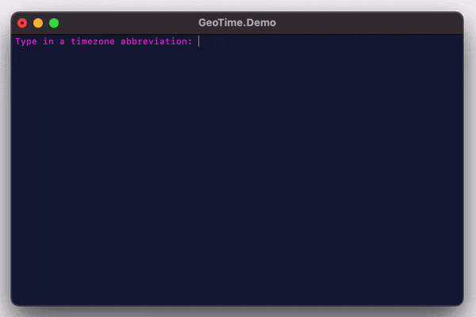

# GeoTime

[](https://github.com/neoncitylights/GeoTime/actions/workflows/dotnet.yml)
[](https://github.com/neoncitylights/GeoTime/actions/workflows/codeql-analysis.yml)

**GeoTime** aims to be a fast, lightweight, and memory-efficient C# library for querying timezone abbreviations.

## Overview
- [GeoTime](#geotime)
  - [Overview](#overview)
  - [Demo](#demo)
  - [System requirements](#system-requirements)
  - [Architecture](#architecture)
    - [The concept of ambiguity](#the-concept-of-ambiguity)
  - [Building the timezone data](#building-the-timezone-data)
  - [Memory and performance](#memory-and-performance)
  - [Usage](#usage)
    - [Check if an abbreviation is ambiguous](#check-if-an-abbreviation-is-ambiguous)
    - [Get an abbreviated timezone by ID or name](#get-an-abbreviated-timezone-by-id-or-name)
    - [Get possible timezones from an abbreviation](#get-possible-timezones-from-an-abbreviation)
  - [License](#license)

## Demo


## System requirements
 * .NET version: 5.x ([C# language version](https://docs.microsoft.com/en-us/dotnet/csharp/language-reference/configure-language-version#defaults): 9.0)

## Architecture
 - **TZAbbr**: An entity representing an abbreviated timezone, which holds: a unique ID, an abbreviation, a name, and an offset (in seconds).
 - **TZAbbrLookup**: A high-level service that allows looking up information about abbreviated timezones
 - **TZAbbrLookupFactory**: A factory for creating instances of a **TZAbbrLookup** service
 - **TZAbbrStore**: A low-level service that holds a read-only dictionary, mapping unique primary keys/IDs to abbreviated timezone (`IReadOnlyDictionary<int, TZAbbr>`)
 - **TZAmbiguityStore**: A low level indexed service that holds a read-only dictionary, mapping timezone abbreviations to a set of timezone IDs (`IReadOnlyDictionary<string, HashSet<int>>`)
 - **TZAScraper**: A service that cleans and indexes the `timezones.json` into smaller and more usable data.

### The concept of ambiguity
We say a timezone abbreviation is *ambiguous*, if it can possibly stand for multiple different timezones. For example, **BST** can mean:
 - [Bangladesh Standard Time](https://en.wikipedia.org/wiki/Bangladesh_Standard_Time) (UTC -06)
 - [Bougainville Standard Time](https://en.wikipedia.org/wiki/Bougainville_Standard_Time) (UTC +11)
 - [British Summer Time](https://en.wikipedia.org/wiki/British_Summer_Time) (UTC +01)

## Building the timezone data
The original timezone data is auto-extracted from an HTML table using a JS snippet, and then placed into `data/timezones.json`.

To build the data and make it usable, you can run the `GeoTime.Build` project, which will produce two files in the `/artifacts` folder:

 - **List** file - `artifacts/timezones.list.json`: Holds a map which maps a unique primary key/ID to an abbreviated timezone.
 - **Ambiguity** file - `artifacts/timezones.ambiguity.json`: Holds a map which maps the timezone abbreviations (string keys) to the unique ID of a timezone it can stand for (array of integers).

Notes:
The following issues are being worked on.
 - Currently, the `GeoTime.Build` project cannot be ran with `dotnet run`, and has to be built with Microsoft Studio IDE.
 - The artifacts are not automatically placed into the `artifacts` folder, and will have to be *manually* moved from `src/GeoTime.Build/bin/Release/net5.0` to `artifacts`.

## Memory and performance
 - The datasets combined (already minified), totals to 20 KB.
   - Compressing into a ZIP will drop it to a total 6.17KB (3.24x smaller).
   - gzipping both files will drop it to a total 5.2KB (3.85x smaller).

Constructing the lookup service will take the most time, as this requires indexing all the timezone data by deserializing two JSON files into C# read-only dictionaries. After creating a lookup, querying for info will generally run under much quicker times.

## Usage
```csharp
TZAbbrLookup lookup = new TZAbbrLookupFactory().GetLookup();
```

### Check if an abbreviation is ambiguous
Checking if an abbreviation is ambiguous takes constant time (O(1) time).

```csharp
lookup.IsAbbrAmbiguous( "CST" ); // true
lookup.IsAbbrAmbiguous( "ART" ); // false
```

### Get an abbreviated timezone by ID or name
Querying an abbreviated timezone by their...
  * ...unique integer ID takes O(1) time.
  * ...unique full name will take linear time (O(n) time), where `n` represents the number of timezone abbreviations.

```csharp
TZAbbr novosibirsk = lookup.GetTimeZone( 149 );
// new TZAbbr( 149, "NOVST", "Novosibirsk Summer Time", 25200 )

TZAbbr argentina = lookup.GetTimeZone( "Argentina Time" );
// new TZAbbr( 22, "ART", "Argentina Time", -10800 )

argentina.Abbr; // "ART"
argentina.OffsetInSeconds; // -10800
argentina.GetOffset().ToString(); // "UTC -03"

TZAbbr someTZ = lookup.GetTimeZone( "Foo" );
// throws TimeZoneNotFoundException
```

### Get possible timezones from an abbreviation
Querying a list of timezones by abbreviation will take O(1+n) time, where n represents the number of timezones an abbreviation can possibly stand for. The first operation will be a dictionary lookup, and the n operations after will be dictionary lookups of the timezones by ID.

* In average case and best case: O(2) (An abbreviation maps to 1 timezone)
* In worst case: O(4) (An abbreviation maps to 3 timezones)

```csharp
lookup.GetTimeZonesByAbbr( "CST" );
/**
   new HashSet<TZAbbr>() {
      new TZAbbr( 61, "CST", "Central Standard Time", -21600 ),
      new TZAbbr( 62, "CST", "China Standard Time", 28800 ),
      new TZAbbr( 63, "CST", "Cuba Standard Time", -18000 )
   }
 **/

lookup.GetTimeZonesByAbbr( "PGT" );
/**
   new HashSet<TZAbbr>() {
      new TZAbbr( 166, "PGT", "Papua New Guinea Time", 36000 )
   }
 **/
```

## License
GeoTime is licensed under the [MIT license](./LICENSE).
